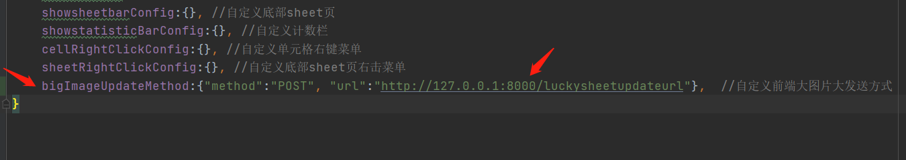
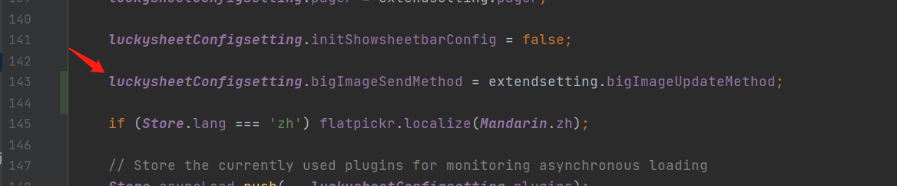
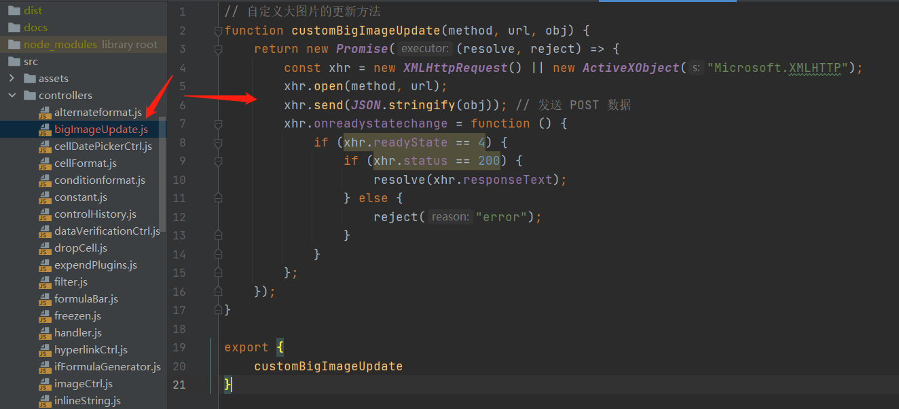
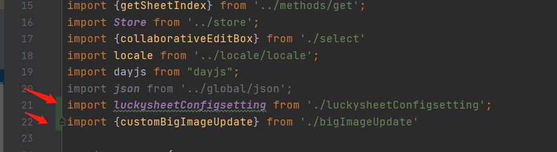
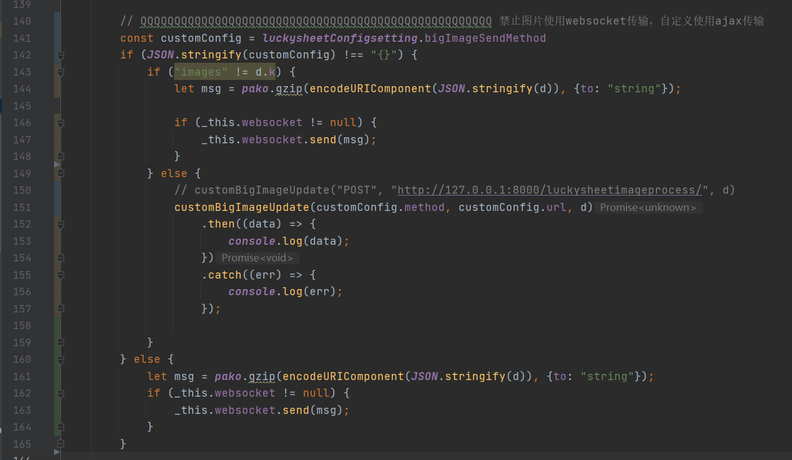

# luckysheet_django
luckysheet + django实现多人在线协同操作excel

[演示地址](http://49.234.35.155:8080/luckysheetindex/) http://49.234.35.155:8080/luckysheetindex/

QQ交流群: 697107880
```使用方法
使用起步：
1、安装python3.7
2、安装jdk，建议jdk8，因为我使用的就是该版本,因为当前py3的解压有bug (https://bugs.python.org/issue24301)
3、安装node.js
    安装
    npm install
    npm install gulp -g
    开发
    npm run dev
    打包
    npm run build
```
### 解决大图片无法通过wss传输的方法：
```
源码 https://github.com/mengshukeji/Luckysheet
解决方案：
        1.首先config里面添加自定义图片的发送配置
        2.把该配置添加到core.js里面
        3.添加一个自定义js文件，把发送图片函数写进去
        4.server.js里面修改原来的wss发送配置
```
详细修改如下：
######1、 config里面添加自定义图片的发送配置, [点击查看config.js](./luckysheet_obj/Luckysheet-master/src/core.js)
```angular2html
bigImageUpdateMethod:{"method":"POST", "url":"http://127.0.0.1:8000/luckysheetupdateurl"},  //自定义前端大图片大发送方式
```

######2、 把该配置添加到core.js里面, [点击查看core.js](./luckysheet_obj/Luckysheet-master/src/core.js)
```angular2html
luckysheetConfigsetting.bigImageSendMethod = extendsetting.bigImageUpdateMethod;
```

######3、 src/controllers/里面添加一个自定义js文件，把发送图片函数写进去
代码块较多，详细请查看 [src/controllers/bigImageUpdate.js](./luckysheet_obj/Luckysheet-master/src/controllers/bigImageUpdate.js)



######4、 src/controllers/server.js  里面修改原来的wss发送配置
4.1 顶部导入所需变量、函数
   ```
   import luckysheetConfigsetting from './luckysheetConfigsetting';
   import {customBigImageUpdate} from './bigImageUpdate'
   ```
4.2 修改wss发送方式，代码较多，详细参考 [src/controllers/server.js](./luckysheet_obj/Luckysheet-master/src/controllers/server.js)




### 初始化加载excel的效果图加载失败
1、 src\controllers\constant.js 里面将加载图片的路径改为 image://static/css/loading.gif

### 当前问题
1、新建一个sheet页的时候，如果别的客户端不点击这个新页面一下电话，那新建一方在新sheet页面的修改就不会被同步到其他客户端。因此别的客户端必须点击
一下新的sheet页，才能把新sheet页的修改同步过来。--2021/02/01

2、筛选功能，当前只能把添加筛选功能同步到其他客户端，无法把去除筛选功能同步到其他客户端。--2021/02/01

3、当前由于py3的gzip的bug冲突，所以暂时解压数据得使用java包了，[gzip的bug](https://bugs.python.org/issue24301) --2021/02/01

### 已解决问题
1、多人协同的时候，无法做到同步，卡在了返回值的这一步，返回格式未能对齐，单双引号导致的  --2021/02/01-问题已解决